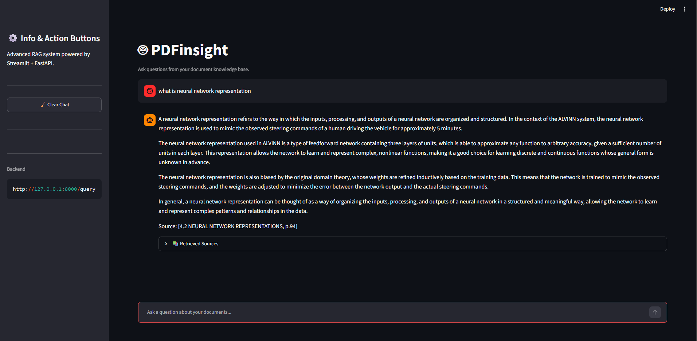

# PDFinsight: Local Retrieval-Augmented Generation over PDFs

A fully local question-answering system for long PDF documents. It combines hybrid retrieval, cross-encoder reranking and a small open-weight LLM served through Ollama, exposed via a streaming FastAPI backend and a Streamlit interface. No external APIs are required. The full system runs on a 6 GB consumer GPU.




## Key Results

Measured on a 400-page machine learning textbook (1,234 chunks), on an RTX 4050 laptop GPU:

- **97% Hit@5 retrieval accuracy** on a 69-question hand-labelled golden set (hybrid search + reranker)
- **290 ms to first token and 0.94 s median generation time** with `llama3.2:3b`
- **0.90 faithfulness and 0.93 answer relevancy** in DeepEval, with a fixed judge model

## Tech Stack

**LLM serving:** Ollama (llama3.2:3b) · **Retrieval:** ChromaDB, BM25, BAAI/bge-small-en-v1.5, ms-marco-MiniLM cross-encoder · **Orchestration:** LangChain · **Backend:** FastAPI (NDJSON streaming), Pydantic · **Frontend:** Streamlit · **Evaluation:** DeepEval, custom retrieval and latency benchmarks · **Ops:** Docker, Docker Compose, Kubernetes manifests, GitHub Actions

## Architecture


- **Ingestion:** PDF to Markdown with `pymupdf4llm`, followed by semantic chunking that preserves section headings and page numbers for citations.
- **Retrieval:** BM25 and dense top-20 results are fused with Reciprocal Rank Fusion, then reranked by a cross-encoder.
- **Generation:** answers are validated against a Pydantic schema, with automatic retries and graceful failure.
- **Observability:** structured per-request JSON logs and a `/metrics` endpoint covering retrieval, reranking and LLM latency and token usage.

## Model Selection

Five instruct models of similar size were benchmarked on identical RAG prompts (~930 tokens), loaded one at a time with prompt caching disabled for fair timings. Answer quality was scored with DeepEval using a fixed judge model (`qwen3:4b-instruct`).

| Model | VRAM | Time to first token | Decode (tok/s) | Generation time | Faithfulness |
|---|---|---|---|---|---|
| **llama3.2:3b** | 2.6 GB | **290 ms** | **72.9** | **0.94 s** | **0.90** |
| granite4:micro | 2.5 GB | 370 ms | 65.1 | 1.47 s | – |
| phi4-mini:3.8b | 3.1 GB | 389 ms | 59.5 | 1.80 s | – |
| qwen3:4b-instruct | 3.2 GB | 463 ms | 55.8 | 2.35 s | – |
| gemma3:4b | 2.9 GB | 528 ms | 55.0 | 1.29 s | 0.76 |

`llama3.2:3b` was selected because it was both the fastest model and the most faithful of those evaluated for quality.
For retrieval, hybrid search with reranking improved top-1 accuracy from 0.59 (BM25 alone) to 0.70, at a cost of about 100 ms.
Full methodology: [benchmarks/](benchmarks/README.md) · [evaluation/](evaluation/README.md)

## Engineering Highlights

- **Measurement-driven tuning:** built a 69-question golden set with verified chunk-level labels and a cached retrieval benchmark, so every change is measured instead of guessed.
- **Tokenization fix:** markdown artifacts such as `**_entropy,_**` were preventing BM25 matches. A regex tokenizer raised Hit@5 from 0.80 to 0.93.
- **Data integrity:** diagnosed a vector store that held every chunk five times, which collapsed the dense top-k results. The store now uses deterministic IDs and repairs itself on startup.
- **Benchmark correctness:** found that Ollama's KV-cache reuse inflated repeated prefill measurements by about 10×, and added per-request cache busting.
- **Fail-fast startup:** the API verifies that Ollama is reachable and that the configured model is installed, and suggests the closest installed name on a typo.

## Quick Start

Requires Python 3.11+ and [Ollama](https://ollama.com).

```bash
git clone https://github.com/SwapnilGEU/Local_Documents_Summerizer.git
cd Local_Documents_Summerizer
pip install -r requirements.txt
ollama pull llama3.2:3b

python app/retrieval.py                    # first run: builds chunks and the vector index
uvicorn api.main:app --port 8000           # API
streamlit run streamlit_app.py             # UI at http://localhost:8501
```

Or with Docker: `docker compose up --build` (Ollama runs on the host).

## Project Structure

```
app/           RAG pipeline: ingestion, chunking, vector store, retrieval, reranking, LLM, validation
api/           FastAPI service with streaming /query and /metrics endpoints
benchmarks/    Retrieval accuracy and LLM speed benchmarks with a 69-question golden set
evaluation/    DeepEval answer-quality evaluation, one result file per model
docs/images/   Screenshots
k8s/           Kubernetes manifests
```
