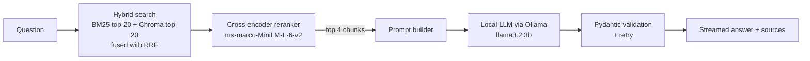

# 🤖 PDFinsight — Local RAG over a PDF

Ask questions about a PDF and get grounded answers, with sources, **entirely on your own machine**.
PDFinsight combines hybrid search (BM25 + vectors), a cross-encoder reranker and a small local LLM served by Ollama, behind a FastAPI backend and a Streamlit UI.

The demo corpus is Tom Mitchell's *Machine Learning* textbook (≈400 pages, 1,234 chunks).

<!-- Add your screenshot to docs/images/ and it will show up here -->


---

## ✨ Highlights

- **100% local:** no API keys. Runs on a 6 GB laptop GPU (RTX 4050).
- **Hybrid retrieval + reranking:** measured to find the right chunk in the top 5 for **97%** of test questions.
- **Model chosen by measurement, not by hype:** 5 local LLMs benchmarked on speed and answer quality (see [How the model was chosen](#-how-the-model-was-chosen)).
- **Production touches:** streaming answers, Pydantic answer validation with retries, graceful failure, structured JSON logs, per-request metrics, Docker and k8s manifests, CI.
- **Reproducible evaluation:** a hand-labelled golden set, a retrieval benchmark, an LLM speed benchmark and a DeepEval quality check.

---

## 🧭 How it works



| Stage | What happens | Why |
|---|---|---|
| Ingestion | PDF → Markdown (`pymupdf4llm`) → cleaned text | Keeps headings and page numbers for citations |
| Chunking | Semantic chunking (`bge-small-en-v1.5`) with a size fallback | Chunks follow topic boundaries instead of fixed character counts |
| Vector store | ChromaDB, one vector per chunk (`id = chunk_id`) | Rebuilt automatically if it ever gets out of sync with the chunks |
| BM25 | Regex tokenizer that strips markdown (`**_entropy,_**` → `entropy`) | This fix alone raised BM25 Hit@5 from 0.80 to 0.93 |
| Hybrid | Reciprocal Rank Fusion of the BM25 and dense lists | Keyword and semantic search catch different questions |
| Rerank | Cross-encoder scores (question, chunk) pairs | Most accurate step, and it lets us send fewer, better chunks to the LLM |
| Generate | Ollama chat model, temperature 0 | Short prompt (~930 tokens), so the time to first token stays low |

---

## 📊 How the model was chosen

Everything below was measured with the tools in [`benchmarks/`](benchmarks/README.md) and [`evaluation/`](evaluation/README.md).

### 1. Retrieval: which search method finds the right chunk?

69 hand-labelled questions across all 13 chapters, 1,234 chunks searched.

| Method | Hit@1 | Hit@5 | Recall@8 | MRR@8 | Latency p50 |
|---|---|---|---|---|---|
| BM25 (clean tokenizer) | 0.59 | 0.93 | 0.89 | 0.72 | 4 ms |
| Chroma (dense) | *re-run pending¹* | | | | 32 ms |
| Hybrid (BM25 + dense, RRF) | 0.62 | 0.96 | 0.94 | 0.75 | 36 ms |
| **Hybrid + reranker** ✅ | **0.70** | **0.97** | **0.95** | **0.81** | 129 ms |

¹ The first dense runs exposed a bug: every chunk was stored 5 times in Chroma, so a top-20 search returned only 4 unique chunks. `app/vectorstore.py` now detects this and rebuilds the index. The dense-only row will be updated after the next benchmark run.

**Decision:** hybrid + reranker. It adds about 100 ms but puts the right chunk first 70% of the time, compared with 59% for either search alone.

### 2. Speed: which LLM is fast on a 6 GB GPU?

Same 10 RAG prompts (~930 tokens each) for every model, 3 repeats, medians, one model loaded at a time.

| Model | Maker | VRAM | Time to first token | Decode tok/s | Total latency | Answer length |
|---|---|---|---|---|---|---|
| **llama3.2:3b** ✅ | Meta | 2.6 GB | **290 ms** | **72.9** | **0.94 s** | 43 tok |
| granite4:micro | IBM | 2.5 GB | 370 ms | 65.1 | 1.47 s | 72 tok |
| phi4-mini:3.8b | Microsoft | 3.1 GB | 389 ms | 59.5 | 1.80 s | 78 tok |
| qwen3:4b-instruct | Alibaba | 3.2 GB | 463 ms | 55.8 | 2.35 s | 110 tok |
| gemma3:4b | Google | 2.9 GB | 528 ms | 55.0 | 1.29 s | 40 tok |

All five are instruct (non-reasoning) models, so their speeds are directly comparable.

### 3. Quality: are the answers faithful to the book?

DeepEval on 5 grounded questions. The **judge is fixed** (`qwen3:4b-instruct`) so scores are comparable across models.

| Model | Faithfulness | Answer relevancy | Contextual precision | Contextual recall | Retrieval hit |
|---|---|---|---|---|---|
| **llama3.2:3b** ✅ | **0.90** | 0.93 | 0.98 | 0.89 | 5/5 |
| gemma3:4b | 0.76 | 0.92 | 0.98 | 0.89 | 5/5 |

Contextual precision and recall are identical because both models received the same retrieved chunks. Only the answers differ.

### ✅ Result: `llama3.2:3b`

The fastest model (lowest time to first token, highest tok/s, smallest VRAM footprint) **and** the most faithful of the models evaluated so far. It is the default in `app/config.py`.
The other models can be added to the quality table with one command each (see [Switching models](#-switching-models)).

---

## 🚀 Getting started

### Prerequisites

- Python 3.11+ (developed in a conda env)
- [Ollama](https://ollama.com) running locally
- Optional: an NVIDIA GPU (the embeddings, reranker and LLM all use it when available)

### 1. Install

```bash
git clone https://github.com/SwapnilGEU/Local_Documents_Summerizer.git
cd Local_Documents_Summerizer
pip install -r requirements.txt
ollama pull llama3.2:3b
```

### 2. Build the index (first run only)

The first import builds everything that's missing: PDF → Markdown → chunks → Chroma.
The source PDF lives in `data/raw/`.

```bash
python app/retrieval.py        # run from the repo root: data paths are relative to it
```

### 3. Start the API and the UI

```bash
uvicorn api.main:app --port 8000          # terminal 1
streamlit run streamlit_app.py            # terminal 2 → http://localhost:8501
```

On startup the API checks that Ollama is reachable **and** that the configured model is installed. A typo such as `llamna3.2:3b` stops startup with a "Did you mean 'llama3.2:3b'?" hint, instead of failing later during a request.

### Or with Docker

```bash
docker compose up --build        # API on :8000, UI on :8501, Ollama on the host
```

---

## 🔌 API

| Method | Endpoint | Description |
|---|---|---|
| `GET` | `/` | Health check |
| `POST` | `/query` | `{"question": "..."}` → streamed NDJSON: `token` chunks, then one `done` chunk with sources and metrics |
| `GET` | `/metrics` | Running averages: request, retrieval, rerank and LLM latency, tokens, validation retries |

```bash
curl -N -X POST localhost:8000/query -H "Content-Type: application/json" \
     -d '{"question": "What is information gain?"}'
```

Every request is logged to `data_logs/<date>/requests/<request_id>.json` with timings for each stage, which is handy for debugging a slow or failed answer.

---

## 🔁 Switching models

Priority: `--model` flag → `LOCAL_MODEL` environment variable → default in `app/config.py`.

```bash
# evaluate another model (results saved to evaluation/results/<model>.json)
python evaluation/run_deepeval.py --model granite4:micro
python evaluation/run_deepeval.py --compare

# run the app with another model, without editing code (Windows cmd)
set LOCAL_MODEL=gemma3:4b
uvicorn api.main:app --port 8000
```

---

## 🗂️ Project structure

```
├── app/                 # the RAG pipeline
│   ├── config.py        # paths, model names, top-k settings
│   ├── ingestion.py     # PDF → Markdown → cleaned sections
│   ├── chunking.py      # semantic chunking + embedding model
│   ├── vectorstore.py   # ChromaDB (self-healing if out of sync)
│   ├── retrieval.py     # BM25 + dense hybrid search (RRF)
│   ├── reranker.py      # cross-encoder reranking
│   ├── llm.py           # Ollama client + startup checks
│   ├── rag.py           # end-to-end pipeline (normal + streaming)
│   ├── schemas.py       # Pydantic answer validation
│   ├── metrics.py       # in-memory metrics collector
│   └── logging_utils.py # structured per-request JSON logs
├── api/main.py          # FastAPI app
├── streamlit_app.py     # UI
├── benchmarks/          # retrieval + LLM speed benchmarks  → see its README
├── evaluation/          # DeepEval answer-quality evaluation → see its README
├── data/                # raw PDF, processed chunks, Chroma index
├── docs/images/         # screenshots for this README
├── notebooks/           # local-only prototypes this project grew from (git-ignored)
├── k8s/  Dockerfile  docker-compose.yml  .github/workflows/ci.yml
```

---

## 🛣️ Next steps

- Re-run the retrieval benchmark to publish the fixed dense-only numbers.
- Add the remaining three models to the quality table.
- Grow the DeepEval set beyond 5 questions for tighter confidence.
- Consider raising `TOP_K_HYBRID` to 20 so the app's reranker sees the same 20 candidates as the benchmarked configuration.

---

Built as a hands-on learning project on local LLM engineering. Feedback and ideas are always welcome! 🙌
